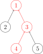
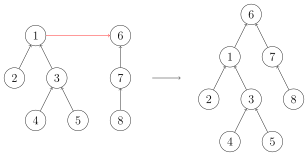

# 并查集

## 引入

并查集是一种用于管理元素所属集合的数据结构，实现为一个森林，每棵树表示一个集合，树中的节点表示对应集合中的元素。

它支持两种操作：

- **合并（Union）**：合并两个元素所属集合（合并对应的树）。
- **查询（Find）**：查询某个元素所属集合（查询对应的树的根节点），可用于判断两个元素是否属于同一集合。

> 并查集在经过修改后可以支持单个元素的删除、移动。

## 初始化

初始时每个元素位于一个单独的集合，表现为一棵只有根节点的树。方便起见，把根节点的父亲设为自己。

```cpp
int ft[10010];
for(int i=1;i<=n;i++)
{
	ft[i]=i;
}
```

## 查询

沿着树向上移动，直至找到根节点。



```cpp
int fd(int x)
{
	return ft[x]==x?x:fd(ft[x]);
}
```

### 路径压缩

查询过程中经过的每个元素都属于该集合，可以直接把它们连到根节点，加快后续查询。


```cpp
int fd(int x)
{
	return ft[x]==x?x:ft[x]=fd(ft[x]);
}
```

## 合并



合并两棵树，只需要把一棵树的根连到另一棵树的根。

```cpp
void join(int x,int y)
{
	int fx=fd(x);
	int fy=fd(y);
	if(fx!=fy)ft[fy]=fx;
	return;
}
```

### 按秩合并（启发式合并）

合并时选哪棵树的根作为新根会影响后续操作复杂度。把节点较少或深度较小的树连到另一棵，避免退化。

复杂度为 $O(m\log n)$（证明略）。

按高度合并的参考实现：

```cpp
void join(int x,int y)
{
	int fx=fd(x);
	int fy=fd(y);
	if(height[fx]==height[fy])
	{
		height[fx]++;
		ft[fy]=fx;
	}
	else
	{
		height[fx]>height[fy]?ft[fy]=fx:ft[fx]=fy;
	}
	return;
}
```

## 删除

要删除一个叶子节点，把它的父亲设为自己即可。为保证要删除的元素都是叶子，可以预先为每个节点制作副本，并把副本作为它的父亲。

```cpp
struct dsu {
    vector<size_t> pa, size;

    explicit dsu(size_t size_) : pa(size_ * 2), size(size_ * 2, 1) {
        iota(pa.begin(), pa.begin() + size_, size_);
        iota(pa.begin() + size_, pa.end(), size_);
    }

    void erase(size_t x) {
        --size[find(x)];
        pa[x] = x;
    }
};
```

## 移动

与删除类似，通过以副本作为父亲，保证要移动的元素都是叶子。

```cpp
void dsu::move(size_t x, size_t y) {
    auto fx = find(x), fy = find(y);
    if (fx == fy) return;
    pa[x] = fy;
    --size[fx], ++size[fy];
}
```

## 复杂度

**时间复杂度**：证明见[这个页面](https://oi.wiki/ds/dsu-complexity/)。

**空间复杂度**：$O(n)$。

## 带权并查集

还可以在并查集的边上定义某种权值，以及这种权值在路径压缩时产生的运算，从而解决更多问题。比如经典的「NOI2001」食物链，可以在边权上维护模 3 意义下的加法群。