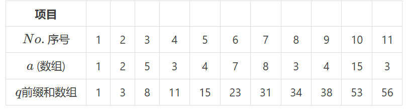

## 什么是前缀和

用前缀和数组 $q_i$ 表示数组 $a$ 的前 $i$ 项之和，即

$$
q_i = \sum_{j=1}^{i} a_j
$$

例如：



### 可以用来

计算 $a_l$ 到 $a_r$ 的和，只要用 `q[r] - q[l-1]` 表示即可。

## 题单

先来道题练练手，模板题：

### [P8218 【深进1.例1】求区间和](https://www.luogu.com.cn/problem/P8218)

### 解答

```cpp
#include <bits/stdc++.h>
using namespace std;
int n,m,l,r;
int a[1000010],q[1000010];
int main()
{
	cin>>n;
	for(int i=1;i<=n;i++)
	{
		cin>>q[i];
		a[i]=a[i-1]+q[i];//前缀和应用
	}
	cin>>m;
	for(int i=1;i<=m;i++)
	{
		int l,r;
		cin>>l>>r;
		cout<<a[r]-a[l-1]<<endl;//计算区间和的公式
	}
	return 0;
}
```

---

再来一道类似的题目：

## [P1865 A % B Problem](https://www.luogu.com.cn/problem/P1865)

思路：用前缀和记录前 $i$ 个数中素数的个数，然后按上述思路求和即可。判断素数请看[教程](https://www.luogu.com.cn/article/oaow1iep)。

```cpp
#include <bits/stdc++.h>
using namespace std;
int n,m,l,r;
int a[1000010];
bool sushu(int x)
{
	if(x==1)return false;
	for(int i=2;i<=sqrt(x);i++)
	{
		if(x%i==0)
		{
			return false;
		}
	}
	return true;
}
int main()
{
	cin>>n>>m;
	for(int i=1;i<=m;i++)
	{
		if(sushu(i)==true)
		{
			a[i]=a[i-1]+1;
		}
		else
		{
			a[i]=a[i-1];
		}
	}
	for(int i=1;i<=n;i++)
	{
		int l,r;
		cin>>l>>r;
		if(r>m||l<1)cout<<"Crossing the line"<<endl;
		else
		{
			cout<<a[r]-a[l-1]<<endl;
		}
	}
	return 0;
}
```

## 小结

到这里，前缀和的基本用法你已经掌握了。它虽然简单，但很多区域套路都是建立在它之上的，值得熟练掌握。