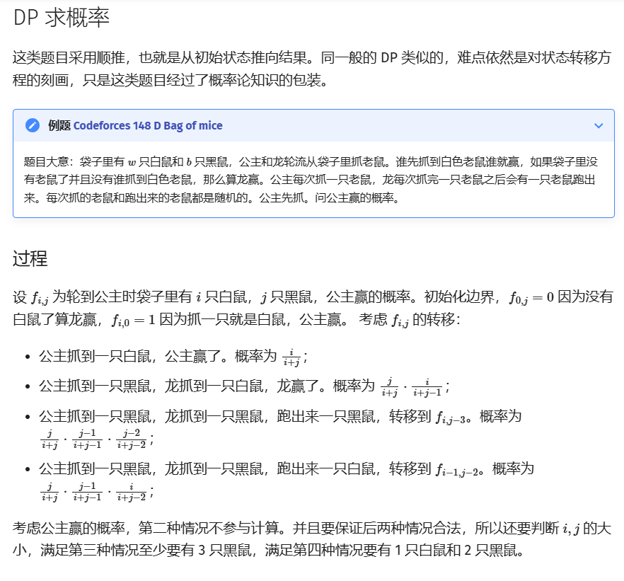

# 概率与期望

> 参考资料：[概率 DP - OI Wiki](https://oi.wiki/dp/probability/)

## 一、基础概念

**概率**描述事件发生的可能性大小。OI 中多数题目适用古典概型：如果可能的结果数为 p，事件 A 发生的结果数为 q，且 p 个事件等可能，则 $P(A) = \frac{q}{p}$。

> [!NOTE] 频率学派的定义
> 若事件 A 在 n 次独立重复实验中发生了 $N_A$ 次，则 $P(A) = \lim_{n \to \infty} \frac{N_A}{n}$。

**期望**是随机变量的加权平均值。对离散随机变量 X：

$$
E[X] = \sum_{i} x_i \cdot P(X = x_i)
$$

即所有可能取值与其概率的乘积之和。

概率与期望的严格数学定义需要测度论，OI 中一般用有限样本空间的古典概型就够了。

## 二、常见问题类型

OI 中的概率问题大致分两类：**直接计算概率**和**求期望值**。

### 1. 概率的递推计算

通过递推或动态规划求解概率，例如：

- **拿球问题**：袋中有红蓝球若干，每次随机取球，求某种颜色被取完的概率。
- **随机游走**：在网格或图中随机移动，求到达终点的概率或期望步数。

### 2. 期望的线性性质应用

期望的线性性（$E[aX + bY] = aE[X] + bE[Y]$）是解决复杂问题的核心工具。例如：

- 若每次试验成功概率为 p，则 n 次独立试验的期望成功次数为 $np$。

### 3. 经典组合问题

结合排列组合与概率模型：

- **卡特兰数**：计算合法括号序列、出栈顺序相关的计数。
- **斯特林数**：处理物品分配、集合划分的期望问题。

## 三、概率 DP 的应用

概率 DP 的设计关键在状态和转移方程，注意两个方向：

- **概率问题**：通常**正序遍历**，当前状态的概率依赖前一阶段的结果。
- **期望问题**：通常**逆序遍历**，期望值往往由后续状态反推。

**示例：** 每一步有 50% 概率获得 1 分或 2 分，求经过 n 步后的期望得分。

- 状态：$dp[i]$ 表示前 i 步的期望得分。
- 转移：$dp[i] = 0.5 \cdot (dp[i-1] + 1) + 0.5 \cdot (dp[i-1] + 2) = dp[i-1] + 1.5$。
- 初始：$dp[0] = 0$，答案是 $dp[n]$。

## 四、期望与均值

期望与均值是两个相近、但完全不同的概念。

- **均值**：实验中对数据作简单平均。
- **期望**：从"上帝视角"提前算出的理论值。

**例子：** 掷骰子。均值要真掷很多次再平均，比如掷 6 次为 1,5,5,6,3,3，均值为

$$
\frac{1+5+5+6+3+3}{6} = 3.8333...
$$

期望却不用掷骰子就能算：

$$
E[X] = \sum_{i=1}^{6} i \cdot \frac{1}{6} = 3.5
$$

两者很容易混。但把多次实验的均值再求平均，就越来越接近期望。

## 五、小结

概率与期望问题的难点在模型抽象和状态设计。需要掌握：概率与期望的定义、期望的线性性质、概率 DP 的递推方向，以及组合数学与容斥原理的配合。多练洛谷题单里的概率期望专题，慢慢会有手感。

