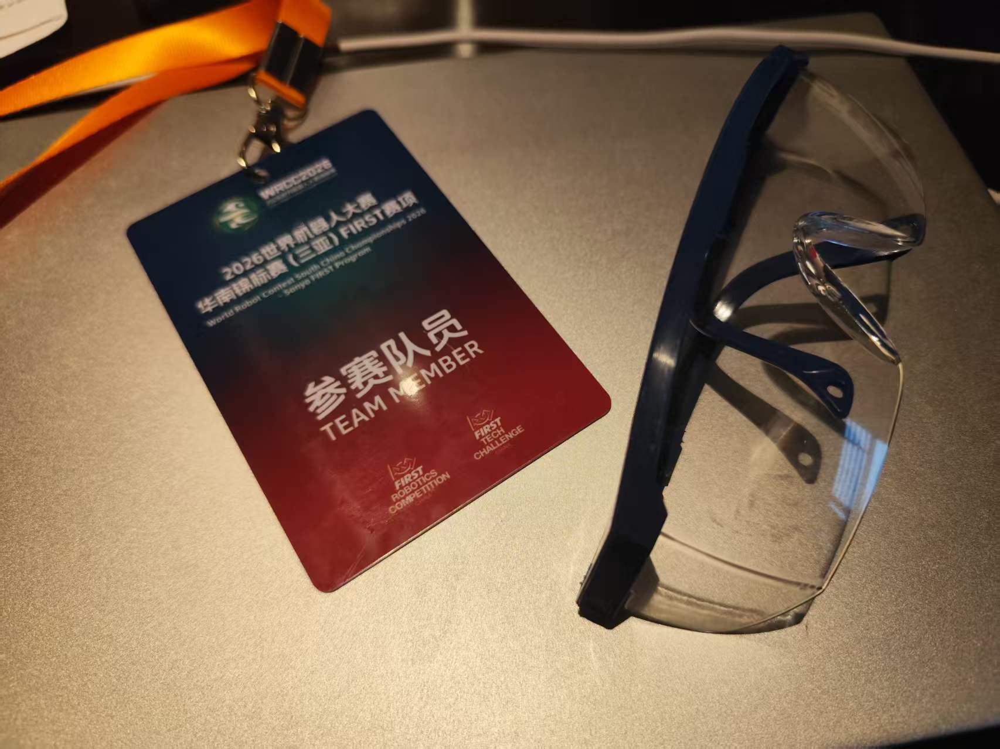
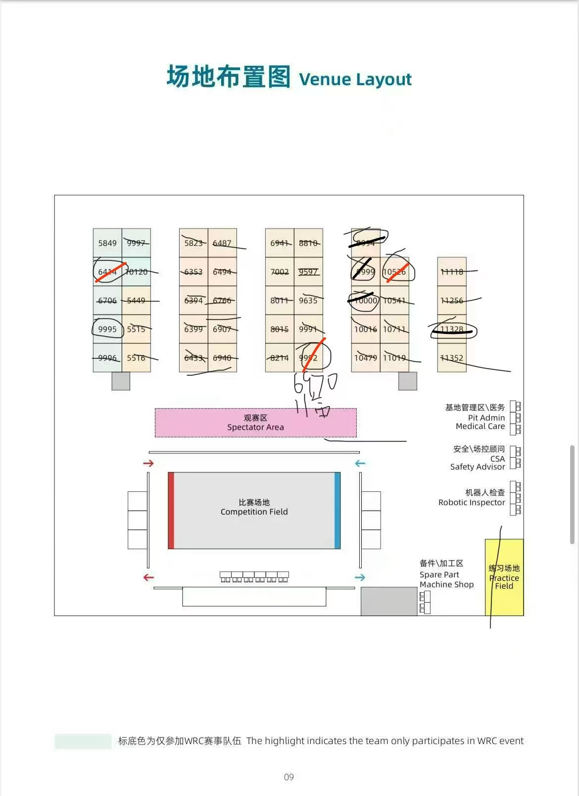
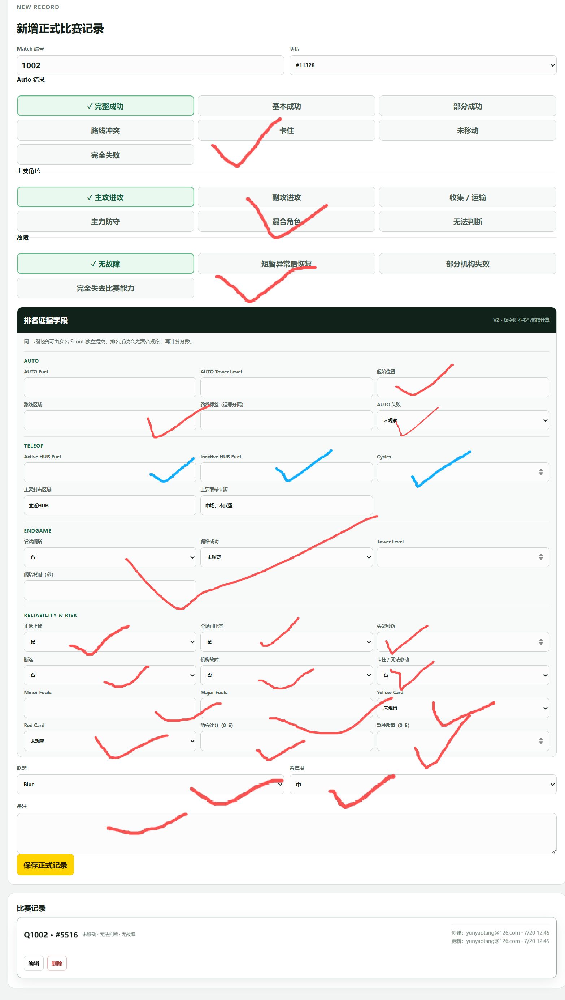
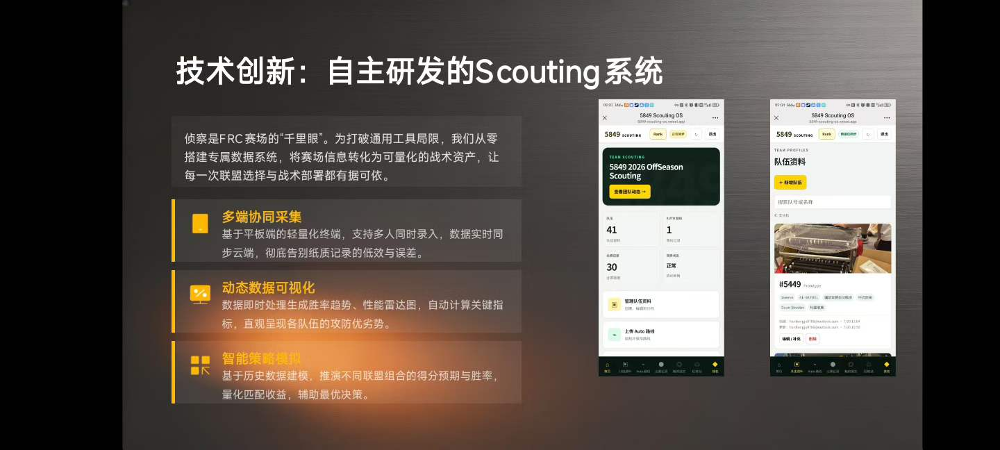
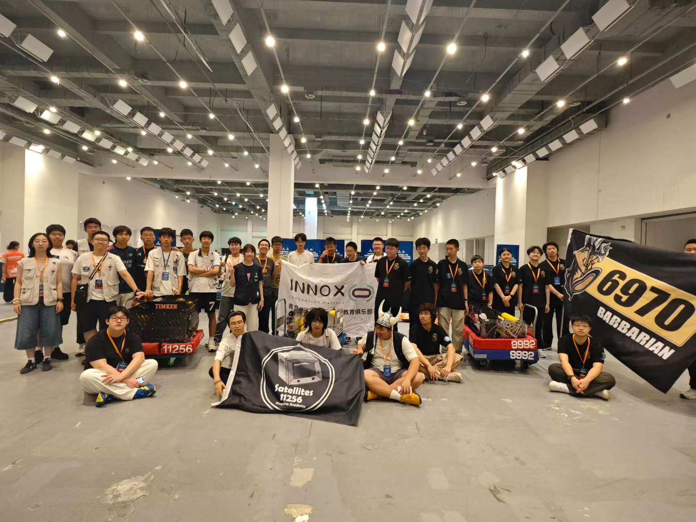
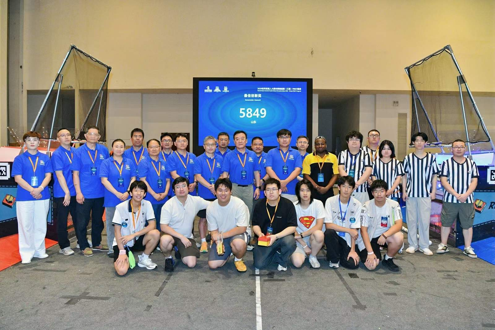

> **导语**
> 本文记录2026年7月，我们5名纯新手跟随队参加FRC三亚季后赛的全过程。如果你也是**准备建队的新手**，希望这些踩坑经验能帮你少走弯路；如果你只是**想了解FRC**，文中保留了足够的现场细节，带你感受机器人竞赛的真实温度。

今年FRC正赛已经过去。为了给未来我们学校独立建队积累经验，我们5名纯新手小白决定先跟着5849队，参加由WRC组织承办的三亚季后赛。

比赛前的准备尤为重要。在这里先记录下**赛前须知的"避坑点"**：

1. 正常穿队服，没有特殊着装安排时，**坚决不要穿洞洞鞋**或非封闭式鞋子，考虑是否穿短裤（虽然三亚很热，但出于安全要慎重）。
2. 赛场**全程佩戴护目镜**。不佩戴会被扣分、被裁判提醒，甚至会导致我们无法申请某些奖项。（_后记经验：其实很多队伍的护目镜只用戴眼睛护翼，无需把整个大护目镜套在眼镜上，以后我们建队可以按这种采购。_）
3. 全程挂好参赛牌，进出场馆必需。
4. 后记：由于三亚较热，建议携带挂脖风扇。

### Day 0：奔波与赛前筹备

**日期：2026.7.19**

早上4点左右我就起床了，动身前往机场。鉴于这个时间，我们约定5:20在机场集合，与11256队伍一行（3个老师带队，21个学生）一起出发。我早上自带了面包，第二趟航班有午饭，中转间隔3小时，时间比较充足甚至稍有富裕。
**航班经验：** 有的机场设有专门的中转柜台，不取行李的话可以直接在那里值机，不用下楼去行李提取处，这样能避免浪费时间再次过安检，这点以后订票一定要注意。

我们分了两个航班，中转方案价格适中、时间合适：

- JD5389 青岛-合肥 06:55-08:35
- EU2713 合肥-三亚 12:05-15:05

经过两次转机，终于抵达三亚。落地后，乘坐组委会安排的大巴，在17:00左右到达了比赛指定的亚龙湾红树林酒店，我们住在椰林酒店的6楼。

此时，我们的设备（机器人及部分工具、耗材）已在凌晨运达。5849的同学立刻投入修车和组装，进行赛前完善。随后，我们学校的几人开了一个赛前会，明确了练习赛和后续Scouting（数据侦察）的分工，并学习了本队cxy队友自研的"5849 Scouting"网页版系统的使用方法——该系统可以同步上传数据并进行比对汇总，十分厉害。
晚上六点，我们去酒店所谓的商业街逛了一圈，发现收获寥寥，遂决定暂时用一顿KFC解决晚饭（晚餐不安排统一自助，自行解决）。

遗憾的是，赛程原定18:00-20:00可以报到注册，可能由于车辆装配没完成加上安排疏忽，我们错过了，下次一定要早点注册。

### Day 1：手忙脚乱的初体验

**日期：2026.7.20**

> **今日赛程：**
> 06:30-07:30 早餐
> 08:00-12:00 练习赛（含午餐休息）
> 12:00-18:00 练习赛
> 18:30 闭馆返回

不得不吐槽，这酒店的5部大电梯运行极慢，而且还不显示楼层。高层（2层以上）等待时间极长，我们只能去找备用电梯。**比赛期间的交通运输一定要把时间成本考虑周全！**

早上6:40闹钟叫醒，7:10去二楼吃自助早餐，时间把控得还行，居然还有清补凉。相比之下，5849的机械组队员为了调车熬了大夜，备赛压力极大。如何**在良好的休息与完善的准备之间找到平衡**，是我们以后建队需要思考的。

因为电梯慢，加上部分准备工作没做完，我们用拖车把工具包、3D打印机和机器搬到赛场时耽误了时间，9:00多才堪堪进场。好在赛场（会展中心）和酒店就隔着一条商业街，我们赶紧去注册区交了FRC声明，随后开始布置Pit区（各队展示、调试区），架好修车架。

**【Scouting 实战与反思】**
8:00-11:00练习赛期间，Pit区一直在调车。我们Scouting小组便分头散布出去，询问各队机器数据并录入系统。主要录入：团队信息、发射类型、取球策略、底盘类型、容量、瞄准方式与发射距离。
在这个过程中我发现，其他队伍的车看起来都很高级，大部分Pit区都有背景板甚至专属棚子，除了物料摆放着全面的宣传信息，简直把包装做到了极致。

_注意Pit区与赛场的相对位置，这决定了往返调车的时间成本。_

随着练习赛进行，我们派人（2人盯红方，2人盯蓝方）在观众席记录比赛。但由于场上情况太复杂，根本盯不过来，我们做出了妥协：**只记录Auto（自动阶段）表现、发球核心表现/流畅性、异常故障，以及队伍角色（主攻/主防/运输），放弃了记录具体进球数。**
经过这次，我认为Scouting其实不需要死磕具体数据，完全可以对各方面进行主观评分（0-5分）来参与排序，这样效率更高。此外，礼貌交流非常重要，拍对手机器前一定要事先询问，一般各支队伍也比较友善（正是FRC"竞合"精神的体现）。

晚上6:30闭馆后，我们找工作人员检测了投影部分（注：根据R102规则，机器人初始状态不得超出外框架垂直投影范围）。由于车一直在修，今天我们没能上场打练习赛。
晚上开了正式赛前会，我们先汇报了scouting的发现，机械组通报了明天的安排，随后是鼓励士气的"涩话环节"，准备迎接明天的奋战！

### Day 2：魔幻的正赛与"神仙队友"

**日期：2026.7.21**

今天正赛开始，安检严格，需要绕行从一个门进场。三亚天气炎热，即使在场馆吹空调里也忙出一身汗。好在我带了便携小风扇（我还看到不少队伍自带了落地大风扇）。
机械组赶在9:00左右通过了全部机检。我们Scout队员则在观众席着重记录几个潜在对手的情报。
正式比赛时，我们scout队员将在观众席观察记录，着重记录几个将来对手队伍，为战术分析提供情报。我们此次季后赛有斗鱼实时直播（大屏幕全场俯视视角），在一天结束后可以看直播的回放视频。参考：[FRC中国赛事直播频道2的个人空间-斗鱼视频](https://v.douyu.com/author-replay/5MdGykGMyn7p)

**【场上状况百出】**
一上场，问题来了：我们车的收集球部分（Intake）出现了结构性问题。前框是铝制的，加上电机重量，单靠现有的扭矩电机和皮带根本无法正常传动。这直接导致**我们整场比赛无法收球发射，只能被迫转为纯防守车。**

但魔幻的事情发生了：虽然第一场输了，但在第2、3、4场比赛中，我们的队友实力强劲。**在神仙队友的带飞下，我们获得了大量RP（Ranking Point 排名按照该积分来），排名最好时居然挤进了第11名！**

当时排名还不错，但清楚这是'虚胖'——一旦进入淘汰赛，无价值的队伍会被联盟队长忽略。这迫使我们必须在最后两场资格赛里证明"防守价值"。

实际上，RP排名可以作为scouting战术分析的重要参考证据之一，它可以用来估计对手实力或预测胜率，观察局势。参考[WRC2025 - Sanya FRC Rankings](https://frc-events.firstinspires.org/2025/OTSAN/rankings)。

回想这几场比赛，我们的车简直是"花式掉链子"：

- 操作手电脑忘了关VPN，导致遥控系统断连，直接趴窝，后续；
- 机器人是无头模式，一旦摆放歪了，操作手就得把遥控器倾斜（甚至反着拿）才能开；
- 电池线路松动脱落导致电压抖动，无法正常操纵；
- 第五场为了强力防守，和对面猛烈撞击，**直接把自己的保险杠给创断了**。

这些经历让我意识到，修车时需要有极好的环境支持，要能随时找到工具而不是满世界借。以后我们可以效仿强队，搭建自制的工作台（见8214等队伍）。不得不说，沟通交流在scouting里是极为重要的技能，非常适合外向的同学与新手参与。

**【场下宣传答辩】**
下午除了看2场比赛，我们还和5849宣传组一起留守Pit区，向评委介绍队伍以申请"崛起之星"奖项。我们准备了精美的PPT，还在答辩最后设计了齐喊"崛起！！"的小仪式。不过因为我们这次只报了"WRC"没报"FRC"，部分奖项无法申请，基本上就是再帮帮机械组同学的忙，就没什么事情了，所以我们一起去附近超市买了饮料作为补给。

**今日最大感悟：** 看了这么多场比赛，我有一种强烈的直觉——在FRC季后赛，**只要机器结构完整且各项功能正常运行（能吸、能射、不趴窝），就绝对称得上是前10左右的强队了。** 相比之下，我们这次确实有很大的运气成分。
晚上依旧吃麦当当。初次体验真实的FRC赛场，高强度的节奏让人精疲力尽，回到酒店我几乎是躺下立马就睡了。

### Day 3：惨痛的教训与意外的惊喜

**日期：2026.7.22**

最后一天，重头戏是淘汰赛（Playoffs）。
简单科普下规则：积分第1名选两个队友组成第一联盟，接着第2名选组成第二联盟，依此类推。然后八大联盟进行双败淘汰赛。

经过昨晚的复盘，今早我们的思路极为清晰：**Intake已废 = 彻底失去得分能力 = 必须把防守做到极致。**
为了做好一辆"无情铁壁防守车"，我们做了几件事：用螺丝把保险杠死死固定（当时恨不得焊死）防止再次撞脱落；用热熔胶枪把所有线路打胶固定，防止电压抖动；提前占好练习场进行最终测试。
_PS：由于保险杠固定的太紧，后面可能拆卸要花大力气了（悲）_

**【致命的犯规】**
上午最后两场资格赛，我们的目标是配合队友拿到240球的RP。但残酷的现实给我们上了一课：
在其中一场比赛中，由于激烈的防御冲撞和操作失误，我们可能违反了G418规则（_紧贴对手机器人超过3秒的计时_），被裁判连续判罚"1 Minor + 3 Major"，**送了对手50分！** 我们直接从微弱领先变成输掉比赛。第二场也因对手发球优势落败，我们的排名瞬间掉到了20多名，令人沮丧。 参考：[FRC Sanya Qualification Match 41](https://frc-events.firstinspires.org/2025/OTSAN/qualification/41)
最终的联盟选择环节，没有队伍选择我们，我们的赛程到此告一段落。
（最后的playoff比赛安排：[WRC-Sanya FRC Playoff Results](https://frc-events.firstinspires.org/2025/OTSAN/playoffs)，参赛时战术组一定要积极查询比赛官网，最好有人的电脑常驻pit区分析）

**【落幕与惊喜】**
比赛结束后，迎来了最轻松的交换物料环节。我们收到了其他队送的徽章、卡片和队服，也送出了自己的物料。随后收拾Pit区，将机器人装箱发快递，并与同为青岛的11256、6970队伍合影留念（这是目前青岛/山东仅有的三支队伍）。

就在我们收拾行囊，以为这场充满波折的三亚之旅就要以此收尾时，惊喜降临了——**组委会居然把"最佳创新奖"颁给了本队！**
这份荣誉既归功于我们今年创新应用的Scouting系统，也因为我们在答辩中展现了作为非一线城市队伍，为本地STEM科学教育推广所做出的努力。这对于我们这群来"取经"的新手来说，无疑是最大的肯定。

伴随着这个沉甸甸的奖杯，这场跌宕起伏的FRC三亚之旅，圆满画上了句号。
回去之后，属于我们自己学校的建队之路，才刚刚开始！
